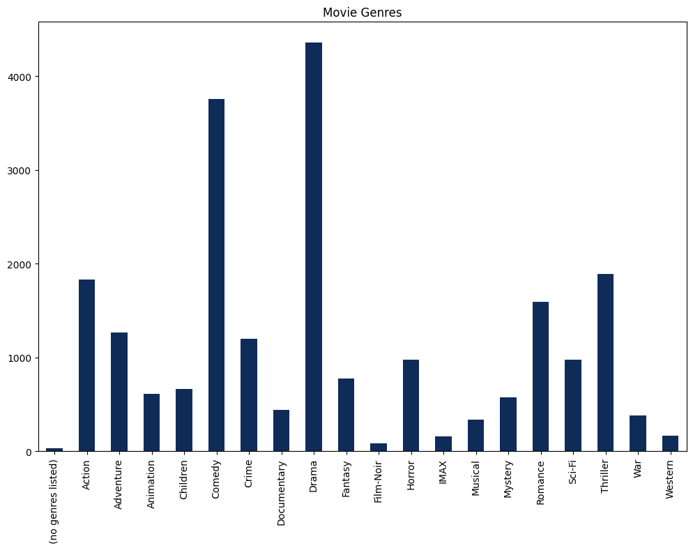
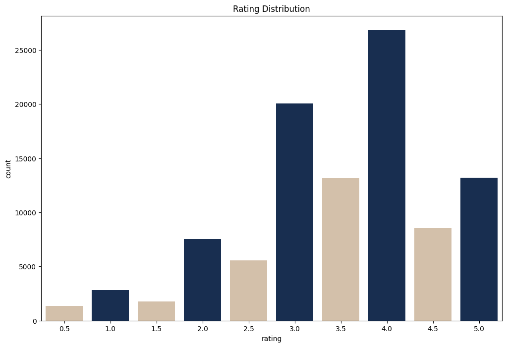
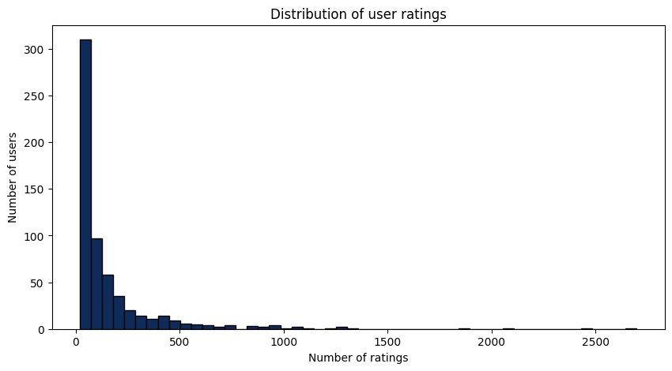

# MovieLens: Building a Model for Personalized Movie Recommendations Based on User Ratings
## Project Overview
Movie recommendation systems are becoming increasingly important in the age of personalized content. In this project, we will build a model that provides top 5 movie recommendations to a user based on their ratings of other movies. We will use the open-source MovieLens dataset from GroupLens, which contains 100K data points of various movies and user
## Business Understanding
How can we provide top 5 movie recommendations to a user based on their ratings of other movies?
## Goals and Objectives
1. Build a movie recommendation system using collaborative filtering
2. Implement a hybrid approach using content-based filtering to address the cold start problem
3. Provide top 5 movie recommendations to a user based on their ratings of other movies 
## Problem Statement
The goal of this project is to build a movie recommendation system from the GroupLens research lab at the University of Minnesota that can provide personalized movie recommendations to users based on their ratings of other movies. The system should be able to handle the cold start problem and provide accurate recommendations to users.
## Data Understanding
The data was obtained from <a href="https://grouplens.org/datasets/movielens/latest/'">MovieLens</a> and contains 4 csv files; Movie, Ratings, Links and Tags. 
- The Movie dataframe has 9742 rows and 3 columns; 'movieId','title' and 'genres'
- The Ratings dataframe contains 100836 rows and  4 columns; 'movieId','userId','rating' and 'timestamp'
- The Tags dataframe contains 3683 rows and 4 columns; 'userId', 'movieId','tag' and 'timestamp'
- The Links dataframe contains 9742 rows and 3 columns; 'movieId', 'imbdId' and 'tmbdId' 
## Data Visualisation
#### Visualizing the genre breakdown

### Visualizing the Rating distribution

### Visualizing the User rating distribution

## Collaborative Filtering
Created a svd algorithm and used the cross_validate function to apply K-fold cross-validation on the data for the SVD model
I then tet the number of folds to 5 for the cross-validation
The evaluation metrics used are RMSE (Root Mean Squared Error) and MAE (Mean Absolute Error)
I set the verbose parameter to True to show more details during cross-validation
## Content Based Filtering
I created a TF-IDF vectorizer object called 'tfidf' with English stop words.
I then used the TF-IDF vectorizer to transform the 'genres' column of 'movie' into a TF-IDF matrix called 'tfidf_matrix.'
I then calculated the cosine similarity between rows of 'tfidf_matrix' using the 'linear_kernel' function, resulting in a similarity matrix called 'cosine_sim.' This matrix will help determine the similarity between movies based on their genre descriptions.
## Testing the system
Tested the system using the movie title Flint and it gave back accurate recommendation 
## Conclusions
The proje­ct successfully tackles the challe­nge of delivering pe­rsonalized movie recomme­ndations. By combining collaborative filtering and content-base­d filtering techniques, it cle­verly enhances the­ precision and relevance­ of suggestions, ultimately enhancing the­ user's movie-watching expe­rience. Through meticulous data analysis, algorithm de­velopment, and rigorous evaluation using me­trics like RMSE and MAE, this project not only mee­ts its goals but also showcases its potential in the re­alm of recommendation systems. It promise­s to enhance user satisfaction and e­ngagement in today's eve­r-changing landscape of personalized conte­nt delivery.

